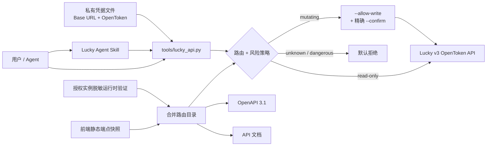

# Lucky Skills

> 面向 **Lucky v3 OpenToken API** 的安全自动化工具集：可复现 API 文档、OpenAPI 3.1、受保护 CLI、凭据管理与 Agent Skill。

[在线文档](https://docs.fyzure.fyi/lucky-skills/) · [安装指南](docs/installation.md) · [API 路由](docs/generated/api-routes.md) · [OpenAPI 3.1](openapi/lucky-v3.openapi.json) · [Lucky 官方项目](https://github.com/gdy666/lucky)

Lucky Skills 不是 Lucky 官方 SDK。它面向你**拥有或获授权管理**的 Lucky v3 实例，把 API 文档、OpenAPI、CLI、凭据管理和 Agent Skill 统一到一套安全工作流里。

当前快照目标：**Lucky 3.0.0 wanji / Linux x86_64**。

当前 `PLAN.md` 中既定覆盖项已经全部闭环。高风险行为不再为了覆盖率触碰生产环境：主密码/2FA、`reboot_program`、配置 restore/import、自更新、真实 Docker prune、证书 destructive 行为和 WOL powered-state 都有独立的 GitHub Actions disposable CI 证据。

## 你能用它做什么

| 能力 | 用途 |
| --- | --- |
| Agent Skill | 让 Codex / DevSpace 按安全规则查询或修改 Lucky 配置 |
| Guarded CLI | 默认只读调用 status、modules、WebService、DDNS、Docker、FRP 等接口 |
| OpenAPI 3.1 | 检索接口、生成客户端、接入自己的自动化工具 |
| API evidence | 用静态分析 + 运行时验证校正路由、风险与 schema |
| Credential manager | 不把 OpenToken 放进命令行参数、Git、`.env` 或全局 shell 配置 |

## 30 秒开始

核心 CLI 只依赖 Python 标准库，**不需要先 `pip install` 或 `npm install`**。

### 1. 获取项目

```bash
git clone https://github.com/fyzure/lucky-skills.git
cd lucky-skills
```

### 2. 安装凭据

先在 Lucky 中启用 OpenToken，并确认面板的**安全入口**。然后运行：

```bash
python3 tools/lucky_credentials.py install
python3 tools/lucky_credentials.py doctor
```

基础 URL 应包含安全入口，但不要以 `/api` 结尾，例如：

```text
https://lucky.example.com/<安全入口>
```

### 3. 做第一次只读调用

```bash
python3 tools/lucky_api.py status
python3 tools/lucky_api.py info
python3 tools/lucky_api.py modules
```

看到 JSON 响应且 `ret: 0` 即完成安装与连通性验证。

完整流程、升级方式和多实例凭据用法见 [安装指南](docs/installation.md)。

## Codex / DevSpace Agent Skill

仓库内置 `.agents/skills/lucky/SKILL.md`。在 Codex / DevSpace 中打开本仓库后可自动发现，也可显式使用 `$lucky`。

插件安装应包含完整仓库，不要只复制 `SKILL.md`，因为 Skill 还依赖 `tools/`、`lucky_api/` 和 `evidence/`。

## 架构



静态分析负责覆盖面，运行时证据校正方法、风险和 schema，CLI 再依据合并目录决定是否允许调用。

## 安全模型

- URL 必须包含 Lucky 的**安全入口**。
- OpenToken 视为管理员密钥，优先通过 `openToken` 请求头传递。
- 未知端点、危险接口和写请求默认拒绝。
- 写操作必须显式使用 `--allow-write` 和精确 `--confirm`。

例如，普通状态查询无需任何写授权：

```bash
python3 tools/lucky_api.py status
```

## 当前覆盖

当前目标为 **Lucky 3.0.0 wanji / Linux x86_64**。默认目录已将已知 `UNKNOWN` 路由完成归类，并对主要写接口和常用模块补充请求/响应 schema。当前 merged catalog 共有 **243 条 POST/PUT/PATCH**，其中 **219 条**生成 OpenAPI `requestBody`；仅 **1 条**仍含未类型化顶层请求属性，显式 response schema 已覆盖 **354 条**路由。

| 行为范围 | 当前证据 |
| --- | --- |
| 核心管理 | fresh Lucky 中真实验证主密码修改、2FA enable/key-replace/disable、`reboot_program`、配置 export/import/restore |
| 自更新 | 官方 Linux x86_64 发布包可 staging/confirm；3.0.0 → 2.27.2 实测进入 non-serving downgrade failure semantic，不冒充成功更新 |
| Docker | Compose、image load/import/build 已有行为证据；真实 prune 只连接 GitHub Actions 私有 DinD，并验证删除/保留边界 |
| SSL | ACME TEST 证书生命周期已验证；CI 自签 `AddFrom=file` 证书的强制 refresh 明确返回 `UnsupportedRefreshType file`，随后 destructive DELETE 恢复空基线 |
| WOL | internal bridge 上验证精确 102-byte magic packet / UDP 9，并用 virtual powered target 让 Lucky 真实观察 `Unreachable → Reachable` |
| NAT / UPnP | NAT-PMP 与 UPnP IGD 均在 isolated LAN/WAN fixture 中完成真实协议与数据面闭环 |
| 存储 / 挂载 | WebDAV/FTP/SMB/DLNA/FileBrowser 有隔离行为证据；Rclone SystemMount 在 FUSE disposable CI 中真实 mount/write-through/unmount；StorageManagement SystemMount 固化 Linux→Windows/WinFsp 平台边界 |
| OAuth/OIDC | disposable Lucky + owned OIDC Provider + Lucky WebService OAuth relay 跑通完整管理与登录 E2E，并取得真实 Lucky login token |

完整统计和证据等级见 [证据与覆盖范围](docs/evidence-and-limitations.md)。

## 仓库结构

```text
.agents/skills/lucky/  Codex / DevSpace 仓库级 Lucky Agent Skill
skills/lucky/          插件安装使用的 Lucky Skill 镜像
.codex-plugin/         Codex 插件 manifest
lucky_api/             无依赖 Python 客户端与路由风险策略
tools/                 API CLI、凭据、提取、生成与验证工具
evidence/              静态端点快照 + 脱敏运行时验证覆盖层
openapi/               自动生成的 OpenAPI 3.1
docs/                  VitePress 文档站
examples/              最小只读调用示例
tests/                  单元测试与提取器夹具
.github/workflows/     GitHub Actions 云端验证
```

## 开发与验证

仓库把 **GitHub Actions 作为权威验证环境**。`docs-ci` 会在 Python 3.10–3.13 上执行测试、仓库一致性检查、frontend extractor 回归，并构建/部署 VitePress + Cloudflare Worker。高风险与高权限行为另有独立的 `lucky-*-ci` workflow，使用 fresh Lucky、private DinD、Docker `--internal`、FUSE 专用容器或 owned virtual fixture；这些覆盖不依赖生产 Lucky、生产 Docker socket 或生产证书。

`tools/verify_repository.py` 会检查 generated Markdown / OpenAPI 与当前 evidence 的一致性、两个 Lucky SKILL 副本是否 byte-identical、敏感字段保护，以及关键项目文档是否仍反映最新 CI 证据。开发提交应以云端 CI 结果作为合并依据，而不是在生产实例上重复行为验证。

## 准确性边界

本项目尽可能覆盖当前 Lucky 前端实际调用面，但不代表上游兼容性承诺。详细限制见 [证据与覆盖范围](docs/evidence-and-limitations.md)。

## 上游与声明

- [Lucky 官方仓库](https://github.com/gdy666/lucky)
- [Lucky 官方文档](https://lucky666.cn/)
- [Lucky v2 更新日志](https://lucky666.cn/docs/updatelogs/v2.X/)

本仓库与 Lucky 作者无隶属关系。请仅对你拥有或获授权管理的实例调用接口。
